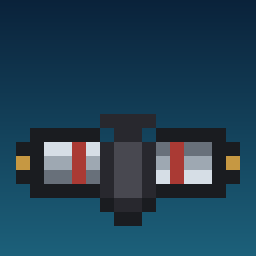

# Miniature Rebreather

Craft a miniature rebreather. Wear it in the helmet slot and you never run out of air underwater.



## Crafting

A piece of dried kelp between two iron nuggets, with leather under it for the mouthpiece:

```
N S N
. L .
```

- `N` — iron nugget
- `S` — dried kelp
- `L` — leather

The recipe unlocks in the recipe book as soon as you join a world.

## What it does

While it is in your helmet slot your air bar stays full. Dive as deep and as long as you like,
in any dimension, with no drowning damage. Take it off, or move it to another slot, and your
lungs go back to normal.

It is only a mouthpiece, so it gives no armour, has no durability, and never wears out. Because
the effect rides on the worn item, anything that can wear a helmet gets it — dress a mob in one
and it breathes underwater too.

## Debug commands

| Command | What |
|---|---|
| `/rebreather` or `/rebreather give` | A rebreather into your inventory |
| `/rebreather status` | Whether it is worn, the air supply out of the maximum, and whether you are underwater |

Permission level 2, so op or cheats.

## Requirements

Minecraft 26.2, Fabric Loader 0.19.3 or newer, and [Fabric API](https://modrinth.com/mod/fabric-api).
Needed on the server; also needed on the client to see the item.

## Building

```bash
./gradlew build
```

The jar lands in `build/libs/`. `./gradlew runClient` starts a dev client and
`./gradlew runGametest` drowns two cows to check the rebreather still works.

## How it works

The item is a plain head-slot equippable with no armour material, and its `inventoryTick` sets
the wearer's air supply back to maximum every tick. Minecraft ticks each worn stack with the slot
it sits in, so the check is one comparison and the effect never leaks to a rebreather that is
merely being carried.

The obvious alternative, the vanilla `minecraft:oxygen_bonus` attribute that powers Respiration,
is capped at 1024. That only turns each tick's air loss into a 1-in-1025 dice roll — very close to
unlimited, but not unlimited, and the bar still creeps down on a long dive.

`tools/make_textures.py` draws the item texture and the project icon from a character grid.

## License

MIT.
