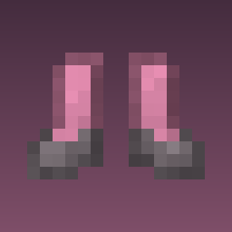

# Plush Boots

Craft a pair of plush boots. While you are wearing them, falling does not hurt.



## Crafting

Four wool of the same colour, in the usual boot shape:

```
W . W
W . W
```

- `W` — four wool, all the same colour

The boots come out the colour of the wool, so red wool makes red boots. All sixteen recipes
unlock in the recipe book as soon as you join a world. Mixing colours in the grid crafts
nothing — pick a colour.

## Dyeing

Combine a pair with any dye in the crafting grid, the same way leather armour is dyed. Stack
dyes for mixed colours, and wash the colour out in a cauldron, which leaves them pink.

## What the boots do

They set your fall damage to zero for as long as they are on your feet. Not reduced, not
capped — every fall, from any height, in any dimension, does nothing. Take them off and
gravity goes back to normal.

Otherwise they are ordinary boots: one point of armour, iron-grade durability, repairable
with wool, and enchantable like any other pair.

They work on anything that can wear boots, so a mob you dress in a pair also lands safely.

## Debug commands

| Command | What |
|---|---|
| `/nofall` or `/nofall give` | A pair of plush boots into your inventory |
| `/nofall status` | Whether the boots are on your feet, plus the live fall damage multiplier |

Permission level 2, so op or cheats. A multiplier of 0 means fall damage is off; 1
means the boots are not on the wearer's feet, whatever the inventory shows.

## Requirements

Minecraft 26.2, Fabric Loader 0.19.3 or newer, and [Fabric API](https://modrinth.com/mod/fabric-api).
Needed on the server; also needed on the client to see the boots.

## Building

```bash
./gradlew build
```

The jar lands in `build/libs/`. `./gradlew runClient` starts a dev client and
`./gradlew runGametest` runs the fall damage test.

## How it works

Fall damage in Minecraft is multiplied by the `minecraft:fall_damage_multiplier` attribute,
so the boots carry an attribute modifier that scales it to zero on the feet slot. That is the
entire mod: no mixin, no tick handler, and it rides along with the item stack rather than
tracking who is wearing what.

The boot textures are vanilla's leather armour re-shaded by `tools/make_textures.py`, and the
sixteen wool recipes come from `tools/make_recipes.py` — a recipe result can carry a colour but
cannot read one off an ingredient, so there is one recipe per wool colour.

## License

MIT.
